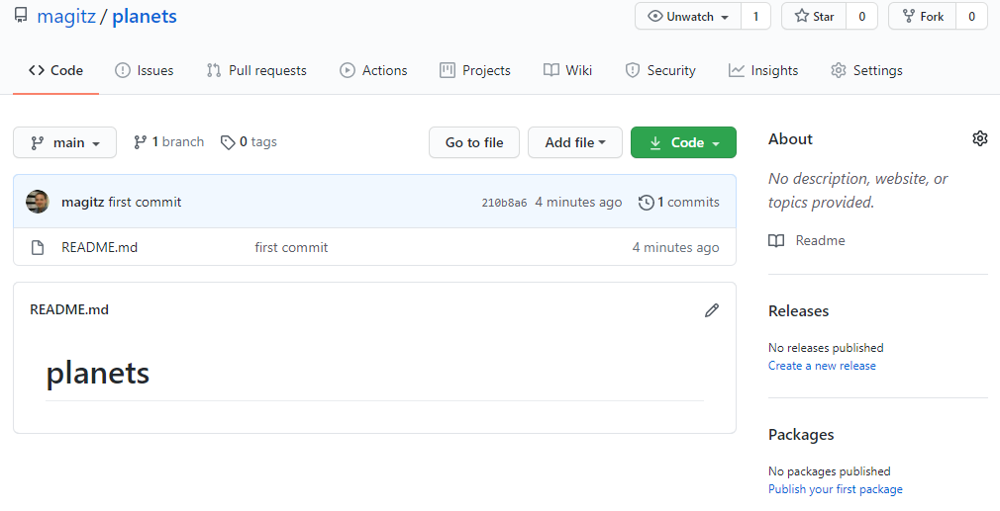
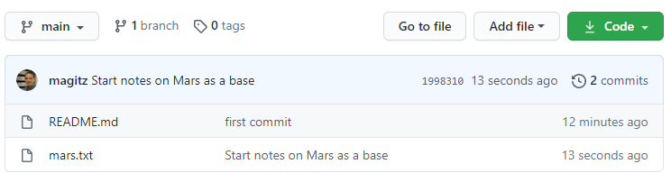

# UF Research Computing git and gitbub.com training

## Hands-on Exercise Page 2, continued from [Page 1](README.md)

### Explore the repo

First, go back to your browser and refresh the page. It should look somethign like this now:


Let's also look at what the directory looks like:
```bash
[magitz@login2 planets]$ ls
README.md
[magitz@login2 planets]$ cat README.md
# planets
[magitz@login2 planets]$ ls -la
total 44
drwxrwxr-x   3 magitz ufhpc   1024 Mar 10 12:38 .
drwxr-xr-x 136 magitz ufhpc 147456 Mar 10 12:38 ..
drwxrwxr-x   8 magitz ufhpc   5632 Mar 10 12:38 .git
-rw-rw-r--   1 magitz ufhpc     10 Mar 10 12:38 README.md
[magitz@login2 planets]$
```
There is one file called README.md. By convention, all repositories should have a README.md and this is a markdown file that describes something about the repo.

Also note that there is a hidden directory called `.git`. This is where the magic of git happens. It is generally a bad idea to mess with hidden directories--that is why they are hidden :smirk:! Just know that this is the directory that makes a normal directory into a git repository and you should generally not touch it.

## Make a change

On the command line, or in your favorite text editor, make a new file, called `mars.txt`:
`nano mars.txt`

And add the following line of text to the file and save the file:

`Cold and dry, but everything is my favorite color`

```bash
[magitz@login2 planets]$ ls
mars.txt  README.md
[magitz@login2 planets]$
```

Git can tell us about the status of the files in a repo:

```bash
[magitz@login2 planets]$ git status
# On branch master
# Untracked files:
#   (use "git add <file>..." to include in what will be committed)
#
#       mars.txt
nothing added to commit but untracked files present (use "git add" to track)
[magitz@login2 planets]$
```
Git is also often helpful with suggesting commands. It found the untracked file `mars.txt` and suggests that to include it, we can run the command `git add mars.txt`. Untracked files are files that git will not track changes for. We don't always want to track all the files in the directory, so we need to tell git which files to track. Let's run that and check the status again:

```bash
[magitz@login2 planets]$ git add mars.txt
[magitz@login2 planets]$ git status
# On branch master
# Changes to be committed:
#   (use "git reset HEAD <file>..." to unstage)
#
#       new file:   mars.txt
#
[magitz@login2 planets]$
```

## `git add` tracks files and stages changes

Remember our image of the git workflow:
 Image from (https://www.git-tower.com/learn/git/ebook/en/command-line/remote-repositories/introduction)

The `git add` command stages the changes. We tell git that when we make a commit, we want the changes to this file to be included in the commit. **Note:** We can make changes to a file and not stage them--in that case those changes are not included in the commit.

## Commit changes 

Now let's commit the changes and check the status again. When we commit changes, we need to add a message that describes what we have changed. These should be relatively short, but descriptive.
```bash
[magitz@login2 planets]$ git commit -m "Start notes on Mars as a base"
[master ea083bf] Start notes on Mars as a base
 1 file changed, 2 insertions(+)
 create mode 100644 mars.txt
[magitz@login2 planets]$ git status
# On branch master
# Your branch is ahead of 'origin/master' by 1 commit.
#   (use "git push" to publish your local commits)
#
nothing to commit, working directory clean
[magitz@login2 planets]$
```
You can see that the commit shows a summary of the commit. We changed 1 file and added 2 lines--in my case anyway, I added a blank line after the line of text. `git status` shows that we are 1 commit ahead of the origin/master. And git again gives us helpful infomration about a command we might want to run: `git push`. Let's run that:
```bash
[magitz@login2 planets]$ git push
Counting objects: 4, done.
Delta compression using up to 32 threads.
Compressing objects: 100% (3/3), done.
Writing objects: 100% (3/3), 343 bytes | 0 bytes/s, done.
Total 3 (delta 0), reused 0 (delta 0)
To git@github.com:magitz/planets.git
   2e264b1..ea083bf  master -> master
[magitz@login2 planets]$
```
And if we go to the web and refresh our repo again, we should see the mars.txt file there now, along with the message from the commit.


Lastly, if we run `git status` again, we will see we are all in sync with nothing to do:
```bash
[magitz@login2 planets]$ git status
# On branch master
nothing to commit, working directory clean
[magitz@login2 planets]$
```
## Make some more changes

Let's add another line of text to the `mars.txt` file. Edit the file so that it has these two lines:
> Cold and dry, but everything is my favorite color

> The two moons may be a problem for Wolfman
Then run `git status` and the new command, `git diff`:
```bash
[magitz@login2 planets]$ git status
# On branch master
# Changes not staged for commit:
#   (use "git add <file>..." to update what will be committed)
#   (use "git checkout -- <file>..." to discard changes in working directory)
#
#       modified:   mars.txt
#
no changes added to commit (use "git add" and/or "git commit -a")
[magitz@login2 planets]$ git diff
diff --git a/mars.txt b/mars.txt
index d927c56..e4d197b 100644
--- a/mars.txt
+++ b/mars.txt
@@ -1,2 +1,3 @@
 Cold and dry, but everything is my favorite color
+The two moons may be a problem for Wolfman

[magitz@login2 planets]$
```
The status shows that we have modified the mars.txt file, but not staged it yet. What command would we need to run to stage the changes?

The `git diff` command shows the line-by-line differences between the last commit and the current state of the file.

Add, commit and push the changes:
```bash
[magitz@login2 planets]$ git add mars.txt
[magitz@login2 planets]$ git commit -m "Add concerns about effects of Mars' moons on Wolfman"
[master 2fbbb5b] Add concerns about effects of Mars' moons on Wolfman
 1 file changed, 1 insertion(+)
[magitz@login2 planets]$ git push
Counting objects: 5, done.
Delta compression using up to 32 threads.
Compressing objects: 100% (3/3), done.
Writing objects: 100% (3/3), 390 bytes | 0 bytes/s, done.
Total 3 (delta 0), reused 0 (delta 0)
To git@github.com:magitz/planets.git
   ea083bf..2fbbb5b  master -> master
[magitz@login2 planets]$

```
