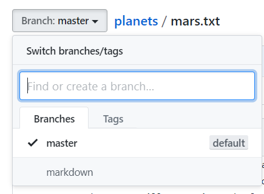
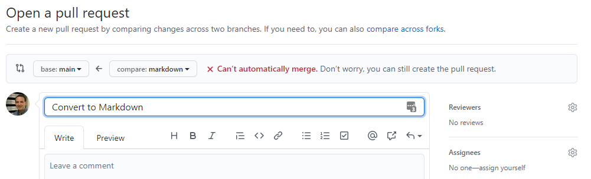
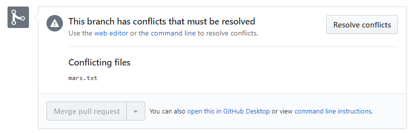
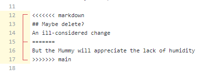
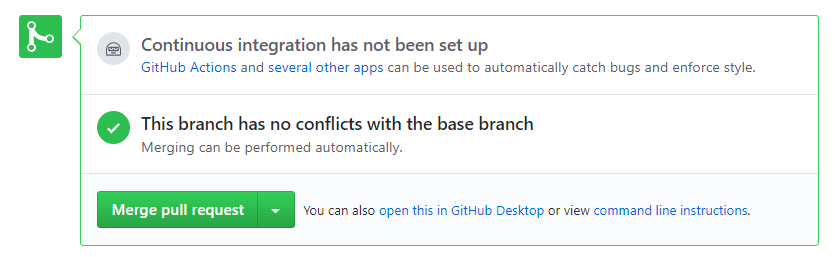

# UF Research Computing git and gitbub.com training

## Hands-on Exercise Page 3, continued from [Page 2](Hands-on2.md)

### Going back in time

Before we time travel, let's add a couple more lines to our `mars.txt` file:

> But the Mummy will appreciate the lack of humidity 

> An ill-considered change

Add, commit and push the change.

The current commit is referred to as the HEAD. One way to see previous versions of the repo is using the `~#` construct to see `#` commits ago. So for example, I can do:

```bash
[magitz@login2 planets]$ git show HEAD~2
commit ea083bf0276b2a81731b864f8d0bafd7a73fafb2
Author: Matt Gitzendanner <magitz@ufl.edu>
Date:   Tue Mar 10 13:06:05 2020 -0400

    Start notes on Mars as a base

diff --git a/mars.txt b/mars.txt
new file mode 100644
index 0000000..d927c56
--- /dev/null
+++ b/mars.txt
@@ -0,0 +1,2 @@
+Cold and dry, but everything is my favorite color
+
[magitz@login2 planets]$
```

Which shows 2 commits prior to the current HEAD. It also shows the commit hash if I want that, the date and time of the commit and the commit message.

If I had messed things up or deleted some important information, I can recover it from previous commits.

### Branching

We currently have a great page with information about Mars. Let's imagine that we want to convert this page to use Markdown. The idea is similar to you having a functional script that you now want to add a feature to or try a new approach for something to see if you can improve functionality, speed or usability. It may take some time to implement your changes and you don't want to break something that works, so it would be nice to work on a copy. With git, we can do this without actually copying everything by using a branch.

Let's create a branch in our repository and name it "markdown":

```bash
[magitz@login2 planets]$ git branch markdown
[magitz@login2 planets]$ git checkout markdown
Switched to branch 'markdown'
[magitz@login2 planets]$
```

You can also do this in one line with `git checkout -b markdown`

Let's run git status:

```bash
[magitz@login2 planets]$ git status
# On branch markdown
nothing to commit, working directory clean
[magitz@login2 planets]$
```

Notice that I am on branch markdown, not master.

Go ahead and edit the `mars.txt` file.

My version of the file now looks like this:

```
# Mars

## Weather
Cold and dry, but everything is my favorite color
But the Mummy will appreciate the lack of humidity

## Moons
The two moons may be a problem for Wolfman

## Maybe delete?
An ill-considered change
```

Here's a git diff:

```bash
[magitz@login2 planets]$ git diff
diff --git a/mars.txt b/mars.txt
index 93a3e13..fb1172d 100644
--- a/mars.txt
+++ b/mars.txt
@@ -1,4 +1,11 @@
+# Mars
+
+## Weather
 Cold and dry, but everything is my favorite color
-The two moons may be a problem for Wolfman
 But the Mummy will appreciate the lack of humidity
+
+## Moons
+The two moons may be a problem for Wolfman
+
+## Maybe delete?
 An ill-considered change
```

Add, commit and push this change:

```bash
[magitz@login2 planets]$ git add mars.txt
[magitz@login2 planets]$ git commit -m "Convert to Markdown"
[markdown 216b39f] Convert to Markdown
 1 file changed, 8 insertions(+), 1 deletion(-)
[magitz@login2 planets]$ git push
fatal: The current branch markdown has no upstream branch.
To push the current branch and set the remote as upstream, use

    git push --set-upstream origin markdown

[magitz@login2 planets]$ git push --set-upstream origin markdown
Counting objects: 5, done.
Delta compression using up to 32 threads.
Compressing objects: 100% (3/3), done.
Writing objects: 100% (3/3), 363 bytes | 0 bytes/s, done.
Total 3 (delta 1), reused 0 (delta 0)
remote: Resolving deltas: 100% (1/1), completed with 1 local object.
remote:
remote: Create a pull request for 'markdown' on GitHub by visiting:
remote:      https://github.com/magitz/planets/pull/new/markdown
remote:
To git@github.com:magitz/planets.git
 * [new branch]      markdown -> markdown
Branch markdown set up to track remote branch markdown from origin.
[magitz@login2 planets]$
```

**Notice** that when we try to do the `git push` git tells us that it can't do that since there isn't an "upstream branch" or somewhere to push to. But again, git offers a suggestion and the command ` git push --set-upstream origin markdown` is indeed what we want--make a branch called "markdown" in the place called "origin"--which is what our github.com repository is called.

Go back to github.com and reload the repo. You will see that there is a notification of a new branch:


Click on the `mars.txt` file. What does it look like?

We are viewing the master branch. Everything is there and just as we left it. If we want to see the markdown branch, we can select that from the pull down:


### Change master branch

We realize that we want to get rid of our ill considered change. But aren't done moving our content to Markdown. That's fine. We can still edit the master branch too. Check out the master branch (`git checkout master`), make the change (deleting the last line "`An ill-considered change`"), add the file, commit the change and push it to github.

### Merge the branch

Now we decide that we are ready to merge our markdown branch into the master--effectively replace the old version with the new version.

Go back to the main page of repo on github and this time, click the "Compare and pull request" button.


On the page that comes up, we are opening a pull request--a request to pull the changes one the markdown branch into the master branch.



Also notice that github is showing that the request Can't be automatically merged. That is because there have been changes made on both the master and markdown branch since the two diverged (when me created the markdown branch). If we hadn't made the change on the master brach above, github would be able to automatically merge the request. But now we need to do some human intervention to sort out the conflicts.

Go ahead and click the "Create Pull Request" button. That pulls up the information about the conflicts that need to be resolved:



Notice that the "Merge pull request" button is greyed out because you have not resolved the conflicts. Click on the "Resolve conflicts" button.



The screen that comes up highlights the parts of the file that are conflicting. Your job is to make it look how you want. You need to delete the <<<<<<<<markdown, =====, etc. and text that you don't want. Essentially git has pointed out where the conflicts lie and added some text to help you find the differences. Now it is up to you to make a file that you want for the merged version.

When you are done editing the file, click the "Mark as resolved" button, then click the "Commit merge" button. As a note, for complex merges, you can make multiple commits in the merge process to break up testing and development on portions of the changes.

Now you can merge the pull request:



Confirm the merge and if you want, delete the markdown branch.

## Summary

Here are the steps we worked through:

* Create a repo in github.com
* Copy and paste the commands to make the repo in a folder on HiPerGator or your own system (folder should have the same name as the repo)
* Make edits to the files in the repo.
* Add the changed files.
* Commit changes with meaningful commit messages.
* Push the changes to the remote repo (github.com)
* Make a branch for development, testing or other work
* Make changes on the branch
* Create a pull request to merge the branch back into the master
* Resolve conflicts and commit the pull request

