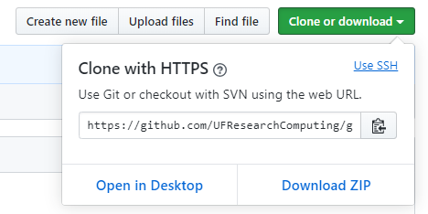
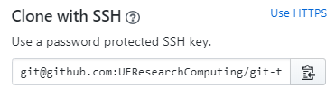

## Configuring git

From: <https://git-scm.com/book/en/v2/Getting-Started-First-Time-Git-Setup>

> The first thing you should do when you install Git is to set your user name and email address. This is important because every Git commit uses this information, and it’s immutably baked into the commits you start creating:

```bash
$ git config --global user.name "John Doe"
$ git config --global user.email johndoe@example.com
```

 > Again, you need to do this only once if you pass the --global option, because then Git will always use that information for anything you do on that system. If you want to override this with a different name or email address for specific projects, you can run the command without the --global option when you’re in that project.

> Many of the GUI tools will help you do this when you first run them.

## Setting an editor

Git uses your system's default editor--typically vim on Linux systems--as the text editor for commit messages. You can configure your preferred editor with one of the examples on this great table from the [Software Carpentry git lesson](http://swcarpentry.github.io/git-novice/02-setup/index.html):

| Editor             | Configuration command (do not type the "$")                           |
|:-------------------|:-------------------------------------------------|
| Atom | `$ git config --global core.editor "atom --wait"`|
| nano               | `$ git config --global core.editor "nano -w"`    |
| BBEdit (Mac, with command line tools) | `$ git config --global core.editor "bbedit -w"`    |
| Sublime Text (Mac) | `$ git config --global core.editor "/Applications/Sublime\ Text.app/Contents/SharedSupport/bin/subl -n -w"` |
| Sublime Text (Win, 32-bit install) | `$ git config --global core.editor "'c:/program files (x86)/sublime text 3/sublime_text.exe' -w"` |
| Sublime Text (Win, 64-bit install) | `$ git config --global core.editor "'c:/program files/sublime text 3/sublime_text.exe' -w"` |
| Notepad++ (Win, 32-bit install)    | `$ git config --global core.editor "'c:/program files (x86)/Notepad++/notepad++.exe' -multiInst -notabbar -nosession -noPlugin"`|
| Notepad++ (Win, 64-bit install)    | `$ git config --global core.editor "'c:/program files/Notepad++/notepad++.exe' -multiInst -notabbar -nosession -noPlugin"`|
| Kate (Linux)       | `$ git config --global core.editor "kate"`       |
| Gedit (Linux)      | `$ git config --global core.editor "gedit --wait --new-window"`   |
| Scratch (Linux)       | `$ git config --global core.editor "scratch-text-editor"`  |
| Emacs              | `$ git config --global core.editor "emacs"`   |
| Vim                | `$ git config --global core.editor "vim"`   |
| VS Code                | `$ git config --global core.editor "code --wait"`   |

## Setting up Two-factor authentication and ssh-keys

As a security best-practice, it is generally best to use two-factor authentication when available. GitHub.com offers two-factor authentication and is configured in the [Settings : Security](https://github.com/settings/security) section of your account.

When you activate two-factor authentication, it does change how you work with your own repositories (you won't be able to push using username and password). In general, it is easiest if you [add a public ssh key to your github.com account](https://help.github.com/en/github/authenticating-to-github/adding-a-new-ssh-key-to-your-github-account). Once you do this, rather than using the HTTPS clone link, select the "Use SSH" link in the top right corner of the box:



and then copy the ssh link:



> There is also a [short video with a walk-through](https://web.microsoftstream.com/video/b0e02a2d-f108-44ff-aea2-276d98a8b524) of setting up ssh keys with github.
